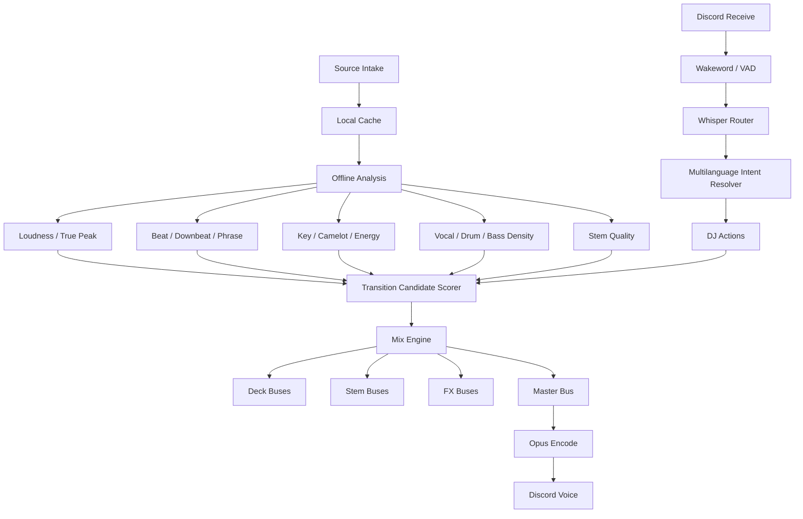
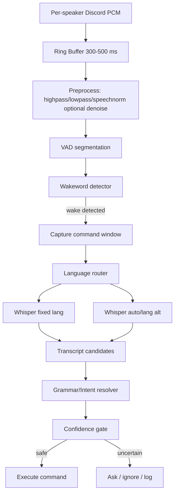

# Beatcord Audio Masterplan, DJ Tech Radar und Voice Command Konzept - Juni 2026

Stand: 2026-06-21  
Merged aus:

- `Beatcord-Engine/docs/beatcord-audio-excellence-concept-2026.md`
- `Beatcord-Engine/docs/beatcord-audio-tech-radar-june-2026.md`

Ziel: Beatcord soll nicht nur ein Musikbot sein, sondern ein kostenlos betreibbares Entertainment-System mit maximaler Audioqualitaet, intelligenter DJ-Logik, starken Transitions, hochwertigem Masterbus und robusten mehrsprachigen Voice Commands.

## Executive Summary

Beatcord ist bereits in einer starken Ausgangslage. Lokal vorhanden sind unter anderem:

- `ffmpeg` 8.1.2 ueber `Beatcord-Bot/bin/ffmpeg`
- `whisper.cpp` 1.9.1 ueber `Beatcord-Bot/bin/whisper-cli`
- `ggml-large-v3.bin` und `ggml-silero-v6.2.0.bin`
- `@discordjs/voice` 0.19.2, `@discordjs/opus` 0.10.0, DAVE-Support via `@snazzah/davey`
- 48 kHz Stereo PCM, 20-ms-Frames, sample-genaue MixDeck-Clock, pregewarmte Decks
- zweipassige `loudnorm`-Messung mit Cache
- Opus-Encoder-Tuning per CTL: Music-Signal, Complexity 10, VBR, FEC, Packet-Loss-Hint
- Automix mit Beatgrid, Downbeat, Intro/Outro, Key, Genre, Energie, Stems und Transition Planner
- Transitions: Blend, Cut, Fade, Filter, Echo, Bassdrop, Spinback, Gate, Roll, Riser, Acapella
- Voice Commands via Discord Receive, Opus Decode, FFmpeg Speech Normalize, whisper.cpp, fuzzy Wakeword/Intent Parser

Die groessten naechsten Hebel sind deshalb nicht "erstmal Audio bauen", sondern:

1. **DSP-Qualitaetsdecke anheben**: Custom-FFmpeg mit `librubberband` und `libsoxr`, optional LV2/LADSPA; interne Mix-Busse langfristig auf Float umstellen und erst am Ende einmal nach s16 dithern.
2. **Transition Intelligence erweitern**: nicht nur Transition-Typ waehlen, sondern pro Track-Paar Transition-Kandidaten scoren: Tempo, Key, Downbeat, Phrase, Vocal-Dichte, Stem-Qualitaet, Intro/Outro, Energieverlauf, Genre und User-Feedback.
3. **Stems als DJ-Werkzeug behandeln**: Stems nicht nur "vocals/no_vocals", sondern Vocal-, Drum-, Bass- und Other-Busse mit Qualitaetsscore, Caching und Transition-spezifischen Regeln.
4. **Voice Commands als eigene ASR-Pipeline bauen**: Wakeword-Detector vor Whisper, `--suppress-nst`, Grammar-Decoding fuer geschlossene Kommandos, Multilanguage-Router, Sprachpakete, Confidence-Gating und Benchmark-Harness.
5. **Messbarkeit einbauen**: Audio-Glitches, Underruns, True Peak, LUFS, Transition-Scores, STT-Latenz, Command-Accuracy und False Activations muessen geloggt werden.

## Harte Plattform-Grenzen

### Discord Output

Discord Voice ist die letzte Flaschenhals-Stufe. Opus kann technisch 6-510 kb/s, 8-48 kHz, 2.5-60 ms Frames, mono/stereo, Musik und Sprache. Discord-Voice-Kanaele setzen aber den realen Kanal-Cap:

- Unboosted: typischerweise bis 96 kbps
- Boost Level 1: 128 kbps
- Boost Level 2: 256 kbps
- Boost Level 3: 384 kbps

Beatcord kann den nativen Opus-Encoder auf hohe Qualitaet trimmen, aber nicht ueber den Kanal-Cap hinaus senden. Deshalb gilt:

- Vor Discord muss das Signal extrem sauber sein.
- Clipping, Resampling-Artefakte, Underruns und schlechte Transitions sind wichtiger als "noch mehr Bitrate".
- Auf Boost-Servern sollte Beatcord den Channel-Bitrate-Cap ausnutzen, was der Code bereits tut.

### DAVE und Audio Receive

Seit Maerz 2026 ist Discord Voice/Video ausser Stage Channels standardmaessig Ende-zu-Ende-verschluesselt. `@discordjs/voice` 0.19.2 bringt DAVE-Support mit `@snazzah/davey`; gleichzeitig bleibt Audio Receive offiziell nicht stabil dokumentiert. Fuer Voice Commands heisst das:

- Sendeseite kann sehr robust sein.
- Empfangsseite fuer User-Mics bleibt ein Risiko und muss best-effort bleiben.
- Voice Command Telemetrie ist Pflicht: Receive-Start, decoded bytes, ffmpeg-STT-WAV, Whisper latency, transcript, command/no-command.

## Lokaler Ist-Zustand

### Playback und Mix

Beatcord verwendet lokale Downloads statt One-Shot-Livestreams. Das ist richtig, weil dadurch Seek, Loudness-Messung, Analyse, Automix und Wiederverwendung moeglich sind.

Wichtige vorhandene Qualitaetsmassnahmen:

- Normaler Discord-Output bleibt 48 kHz Stereo s16le; Automix-Decks dekodieren
  intern nach 48 kHz Stereo f32le und werden erst am finalen Frame nach s16 quantisiert.
- `HQ_RESAMPLE` ist per `FFMPEG_RESAMPLER=swr|soxr` schaltbar. Standard bleibt
  `swr` mit grossem Filter; der Ultra-Stack nutzt
  `aresample=48000:resampler=soxr:precision=33:cheby=1:async=1:first_pts=0:dither_method=triangular_hp`.
- `SAFETY_LIMITER` nutzt `alimiter=limit=0.97:level=false:attack=5:release=50`.
- Decks werden mit `-re` gepaced, damit nicht ganze Tracks als PCM im RAM landen.
- MixDeck erzeugt exakt 20-ms-Frames und kompensiert Timer-Drift.
- Pre-warmed decks vermeiden 30-50 ms Startlatenz bei beatgenauen Crossfades.
- Tempo-Sync ist per `FFMPEG_TEMPO_STRETCHER=atempo|rubberband` schaltbar.
  Der Ultra-Stack nutzt Rubberband fuer hochwertigere Tempo-Aenderungen ohne
  Pitch-Shift.
- FFmpeg Ultra ist mit LV2/LADSPA Plugin-Hosts gebaut. `mda-lv2` liefert freie
  LV2-Effekte; lokale LADSPA-Beispielplugins liegen unter
  `Beatcord-Bot/vendor/audio-plugins/ladspa`.
- Der erste Offline-Premium-Renderer ist implementiert: `bun run audio:render`
  rendert Blend/Fade/Filter/Echo/Bassdrop/Gate/Riser mit SoXR, Rubberband,
  float-interner Filterkette, optionalem LV2-Limiter, LADSPA-Trim und finalem
  Safety-Limiter.
- Automix kann diesen Renderer jetzt im Prefetch nutzen: wenn ein renderbarer
  Uebergang rechtzeitig fertig wird, spielt MixDeck ein fertiges Offline-Segment
  und uebernimmt danach Track B an der berechneten Resume-Position. Wenn Rendering
  zu langsam ist oder fehlschlaegt, bleibt der Live-Crossfade der Fallback.
- Band-Split-EQ fuer DJ-Bass-Swaps ist vorhanden.
- MixDeck mischt Live-Frames ueber einen Float-Accumulator und quantisiert erst am
  Frame-Ende ueber Soft-Knee-Limiter/Dither nach s16 fuer Discord.
- TTS/Narrator wird samplegenau ueber die Musik gelegt und ducked den Music-Bus.

### Automix und Analyse

Vorhanden:

- Beatgrid via `music-tempo`, Aubio-Tempo-Fallback/Pruefung, Downbeat-Phase
- Intro- und Musical-End-Erkennung per RMS-Envelope
- Key Detection via Essentia-Fallback/Local Analyzer
- Energy, Percussiveness, Danceability, Spectral Features
- Genre Classification
- Transition Planner mit Tempo Gap, Key Score, Energy, Genre und Stem-Ready-Gating
- Demucs-Stems fuer Acapella-Transitions

Das ist eine sehr gute Basis fuer ein echtes Auto-DJ-System.

### Voice Commands

Aktuelle Pipeline:

1. Discord Voice Receive erkennt `speaking.start`.
2. Pro User wird Opus subscribed.
3. `prism-media` dekodiert Opus nach 48 kHz stereo PCM.
4. FFmpeg wandelt nach 16 kHz mono WAV und nutzt `speechnorm=e=12.5:r=0.0001:l=1`.
5. `whisper-cli` transkribiert mit fixierter Guild-Sprache (`de`/`en`), VAD und Silero-Modell.
6. Parser matcht Wakeword fuzzy und mapped EN/DE-Synonyme plus beobachtete Whisper-Misshears.

Schon gut geloest:

- Kein Crash bei STT-Fehlern.
- Concurrency-Cap fuer Whisper.
- VAD Modell wird graceful erkannt.
- Wakeword fuzzy matched "beatcord"/"bit code"/"dj".
- German word order fuer `play` wird beruecksichtigt.
- Letter-salad transcripts werden abgelehnt.

Schwaechen:

- Whisper laeuft aktuell auf jeder gehoerten Aeusserung, nicht erst nach einem echten Wakeword-Detector.
- Sprache ist serverweit fixiert; echte mehrsprachige Nutzung in einem Channel ist nur begrenzt.
- Geschlossene Kommandos nutzen noch kein Whisper Grammar-Decoding.
- Command Confidence ist implizit; der Parser gibt nur Command oder Null.
- Keine systematische Command-Accuracy-Metrik.

## Zielarchitektur



## Audio Excellence Layer

### 1. Source Selection

Ziel: den besten verfuegbaren Audiostream holen, bevor ueberhaupt DSP passiert.

Empfehlungen:

- `yt-dlp` Format-Strategie auf bestes Audio priorisieren.
- Container/Codec/Bitrate in Track-Metadata speichern.
- Quelle scoren: Opus/WebM 48 kHz oft ideal fuer Discord, AAC/M4A gut, sehr niedrige Bitraten markieren.
- Keine mehrfachen Lossy-Reencodes im Cache erzeugen.
- Wenn mehrere Quellen fuer denselben Track existieren, das hoehere Audio-Score-Asset bevorzugen.

### 1b. Search Quality: YouTube Music vor generischem YouTube

Problem aus der Praxis: generisches `ytsearch` liefert oft Reuploads, Lyrics-Channels,
Live-Versionen, "sped up", Karaoke, falsche Creator, falsche Thumbnails oder
Official-Video-Uploads mit Intro/Outro. Das schadet:

- Cards/Queue sehen falsch aus.
- Lyrics Lookup bekommt falsche Artist/Title-Paare.
- Beatmatching analysiert falsche Versionen.
- Audio ist haeufig schlechter oder anders gemastert.

Lokaler Befund am 2026-06-20:

- `yt-dlp` 2026.06.09 kennt keinen einfachen `ytmusicsearch5:` Prefix.
- Der funktionierende Weg ist `https://music.youtube.com/search?q=<query>#songs`.
- YT-Music-Flat-Suche liefert saubere Song-IDs, aber kaum Metadaten.
- Full extraction einer YT-Music-Song-URL liefert dagegen `track`, `artist`,
  `artists`, `album`, `duration`, hochwertige Thumbnails und dieselben besten
  Audioformate wie der YouTube-Video-Endpunkt.

Implementierter Zielpfad:

1. Freitext-Suche zuerst gegen YouTube Music Songs:

   ```text
   https://music.youtube.com/search?q=<query>#songs
   ```

2. Top-Kandidaten voll extrahieren, damit Beatcord echte Musik-Metadaten bekommt.
3. Ranking danach:
   - YT Music URL stark bevorzugen
   - `track + artist + album` stark bevorzugen
   - Topic/Official Audio weiter positiv werten
   - Live/Cover/Karaoke/Instrumental/Remix/Sped-up/Slowed/Nightcore/Reaction stark abwerten
4. Fallbacks:
   - generisches `ytsearch`, falls YT Music keine Songs liefert
   - SoundCloud nur, wenn YouTube/YT Music nichts brauchbares findet

Beispiele aus der lokalen Probe:

- `cro traum` -> `Traum`, Artist `CRO`, Album-Metadaten ueber YT Music, 196s.
- `daft punk one more time` -> YT-Music-Song-IDs mit Artist `Daft Punk`, statt
  beliebige Lyrics/Reupload-Kandidaten.
- `helene fischer atemlos` -> offizielle YT-Music-Song-IDs mit Artist `Helene Fischer`,
  nicht GermanHype/Reupload.

Naechste moegliche Stufe:

- Optional `ytmusicapi` als Metadaten-Suchschicht testen. Die Library bietet
  `YTMusic.search(query, filter="songs", limit=N)` und liefert direkt `videoId`,
  `title`, `artists`, `album`, `duration_seconds` und Thumbnails. Dann wuerde
  `yt-dlp` nur noch fuer Download/Format-Auswahl laufen.
- Vorteil: weniger Full-Extraction-Calls, bessere Song-Metadaten schon im ersten
  Suchschritt.
- Nachteil: zusaetzliche Python-Dependency und inoffizielle YouTube-Music-Web-API.

Wichtig fuer yt-dlp-Qualitaet:

- `yt-dlp` empfiehlt fuer vollen YouTube-Support eine JavaScript Runtime plus
  `yt-dlp-ejs` Challenge Solver. Ohne Runtime liefert yt-dlp 2026.06.09 die
  Warnung, dass YouTube-Extraction ohne JS-Runtime deprecated ist und Formate
  fehlen koennen.
- Implementiert am 2026-06-20: Beatcord erkennt eine Runtime automatisch in der
  yt-dlp-Prioritaet `deno -> node -> quickjs -> bun` und haengt sie zentral als
  `--js-runtimes <runtime>:<path>` an jede yt-dlp-Invocation. Lokal wird derzeit
  Bun 1.3.14 genutzt; das liegt exakt im von yt-dlp 2026.06.09 noch unterstuetzten
  Bun-Fenster 1.2.11 bis 1.3.14, bleibt aber nur ein Fallback, weil Bun-Support
  bereits deprecated ist.
- `--remote-components ejs:npm` wurde getestet, aber nicht in den Code uebernommen:
  der offizielle `yt-dlp-zip`-Build bringt die noetigen EJS-Komponenten bereits mit.
- Kostenlose Verbesserung fuer Deployments: Deno >= 2.3 oder Node >= 22 bereitstellen.
  Die Engine bevorzugt diese automatisch vor QuickJS/Bun.
- Metadaten-Enrichment nutzt `--ignore-no-formats-error`, damit Track/Artist/Album
  auch dann noch verwertbar bleiben, wenn YouTube einzelne Formatlisten blockt.
- Playlist-Suche optimiert am 2026-06-20: Top-Playlisten werden mit einem sehr
  kurzen `--playlist-end 1`-Resolve fuer `playlist_count`, Uploader und kanonische
  URL angereichert; Search- und Expansion-Ergebnisse liegen kurzzeitig im LRU-Cache.
- Album-Expansion optimiert am 2026-06-20: Alben werden ueber
  `music.youtube.com/browse/<MPRE...>` expandiert und alle Albumtracks werden
  voll angereichert. Ergebnis: YT-Music-Track-URLs, saubere `track`/`artist`/`album`
  Metadaten und bessere Thumbnails statt flacher artist-loser Playlist-Eintraege.
- Radio/Autoplay optimiert am 2026-06-20: `resolveRadio(seedId)` nutzt YouTube
  Musics `RDAMVM<videoId>`-Mix via yt-dlp, cached Radio-Ergebnisse fuer 10 Minuten
  und enrich-t die Top-Kandidaten. `RDAMVM` liefert im lokalen Test bessere
  Music-URLs und passendere Song-Kandidaten als generisches YouTube-`RD<videoId>`.
  Dadurch bekommen Auto-Radio und Now-Playing-Vorschlaege bessere Artist-/Titel-/
  Thumbnail-Daten, ohne bei jedem Card-Refresh oder Queue-Refill erneut yt-dlp zu
  belasten.
- Research-Notiz: ytmusicapi dokumentiert fuer Album-/Playlist-Radio
  `RDAMPL<playlistId>` und fuer Shuffle den Watch-Playlist-Shuffle-Endpunkt. Reines
  yt-dlp kann `RDAMPL...` lokal nicht direkt lesen (`playlist type is unviewable`);
  fuer echtes Album-/Playlist-Radio ist daher ein optionaler ytmusicapi-Metadaten-
  Layer die naechste sinnvolle Stufe, waehrend yt-dlp weiter den Download/Audio-
  Pfad uebernimmt.
- Implementiert am 2026-06-20: optionaler YTMusic-Catalog-Layer via Python
  `ytmusicapi` (PyPI latest am 2026-06-20: 1.12.1, Requires Python >=3.10). Wenn
  installiert, nutzt Beatcord offizielle YTMusic-Daten fuer Song-Suche,
  Search-Suggestions, Playlist-Suche, Album-Metadaten, Album-Expansion und
  Watch-Playlist-Radio. yt-dlp bleibt die Audio-Extraction/Download-Engine.
  Fallback bleibt vollstaendig erhalten, wenn `ytmusicapi` nicht installiert ist
  oder kein Python >=3.10 mit installiertem Package gefunden wird.
- Neuer Engine-Pfad fuer echte Playlist-/Album-Radio- und Shuffle-Funktionen:
  `resolvePlaylistRadio`, `resolvePlaylistShuffle`, `resolveAlbumRadio` und
  `resolveAlbumShuffle`. Diese nutzen den YTMusic-Watch-Endpoint statt reinem
  yt-dlp-Scraping und umgehen damit das lokale `RDAMPL...`-Extractor-Problem.
- Voice-Suchrobustheit: Wenn eine Suche leer laeuft, probiert die Engine jetzt
  YTMusic Search-Suggestions als Korrekturpfad. Das ist besonders wertvoll fuer
  Whisper-Fehler, Dialekte und gemischte DE/EN-Musiktitel.
- Downloads bleiben beim progressiven Audio-Pfad plus `youtube:skip=hls,dash`; dazu
  kommen Retry-Backoffs via `--retry-sleep` fuer HTTP-, Fragment- und Extractor-Retries.
- Format-Strategie beibehalten: `bestaudio[acodec=opus]/bestaudio[ext=m4a]/bestaudio/best`.
  Fuer Discord ist Opus 48 kHz meistens der beste erste Treffer, weil es ohne
  unnoetige Codec-Wandlung in den 48-kHz-Discord-Pfad passt.

### 2. Decode und Resampling

Aktuell gut:

- 48 kHz Stereo als Discord-Zielformat.
- Dithering `triangular_hp`.
- `async=1:first_pts=0` fuer saubere Timeline.

Naechster Sprung:

- Implementiert am 2026-06-20: Custom-FFmpeg mit `--enable-libsoxr` bauen,
  `FFMPEG_RESAMPLER=soxr` setzen und die aktive Playback-Filterkette per
  `bun run audio:report` pruefen.
- Implementiert am 2026-06-20: Tempo-Sync/Crossfades koennen per
  `FFMPEG_TEMPO_STRETCHER=rubberband` statt `atempo` laufen. Das Ultra-Profil
  nutzt `rubberband=tempo=...:pitch=1:transients=crisp:detector=compound:phase=laminar:window=standard:smoothing=off:formant=preserved:pitchq=quality:channels=together`.
- Nicht blind umstellen: SWR mit grossem Filter kann gut sein; entscheidend ist A/B-Messung auf Bright Material, Fades und Hi-Hats.
- Implementiert am 2026-06-21: Interne Automix-Decks dekodieren nach `f32le`,
  mischen in Float und dithern/limitieren erst am finalen s16-Output.
- Bugfix am 2026-06-21: Der f32-Umbau hatte eine Skalenluecke. ffmpeg liefert
  `f32le` normalisiert im Bereich ±1.0, aber die MixDeck-Mathematik (Limiter,
  `finalizeFloatSample`, `PCM_MAX`, Riser-Noise, `#recent`/Voiceover) rechnet
  weiterhin in s16-Skala (±32767). Dadurch quantisierte jeder Automix-Frame ein
  ~±0.3-Float auf 0 → kompletter Tonausfall im Automix-Pfad (der einfache
  `createPlaybackResource`-Pfad war nicht betroffen, weshalb es als "Bot spielt,
  aber kein Ton" auffiel). Fix: `Deck.readFloatInto` skaliert die gelesenen
  Samples genau einmal mit `PCM_MAX` (±1.0 → ±32767). Damit ist der Deck der
  einzige f32→s16-Skalen-Uebergang; alle Konsumenten (Primary, Crossfade A/B,
  Acapella, Offline-Render-Deck) bekommen automatisch die richtige Skala.

Warum Float-Mix:

- Decks dekodieren im Automix-Pfad inzwischen nach f32le, der Live-Mix summiert
  A/B/FX/Acapella/Narrator in einem Float-Accumulator und quantisiert erst am
  Frame-Ende fuer Discord nach s16.
- Offen fuer spaeter: segmentgenaue Drum-/Bass-/Other-Dichte statt globaler
  Stem-Fenster; Vocal-Dichte ist fuer Incoming-Cue-Fenster implementiert.
- Float erlaubt Headroom, bessere EQ/FX-Stufen, Lookahead-Limiter und nur eine finale Quantisierung.

### 3. Time-Stretch und Key-Lock

Aktuell:

- Tempo-Sync nutzt `atempo`.
- Gut fuer kleine Anpassungen.

Non-plus-ultra:

- FFmpeg mit `librubberband` bauen.
- Fuer Tempo-Sync und Key-Shift `rubberband` nutzen, weil es fuer Time-Stretch/Pitch-Shift gebaut ist.
- Transient-/Detector-/Phase-Modi pro Genre testen:
  - EDM/Drums: transient crisp/percussive
  - Vocals/Acapella: smooth/formant-schonend, falls verfuegbar
  - Chill/Ambient: smoother phase

Moegliches Target:

```text
rubberband=tempo=0.973:pitch=1.000:transients=crisp:detector=percussive:phase=laminar
```

Die exakten Optionsnamen muessen gegen den gebauten FFmpeg geprueft werden.

### 4. Loudness und Headroom

Aktuell sehr gut:

- Zweipassige `loudnorm`-Messung.
- Ziel: -14 LUFS, -1.5 dBTP, LRA 11.
- Cache persistiert Messungen.

Erweiterung:

- Track-Metadata um `measured_lufs`, `true_peak`, `lra`, `loudness_confidence` erweitern.
- Fuer live gemischte Transitions zusaetzlich Masterbus-Peak/Short-Term-LUFS messen.
- Bei Acapella/Mashup Transitions temporaer 1-3 dB mehr Headroom einplanen.
- Master-Limiter nicht lauter machen lassen; nur Spitzen fangen.

### 5. Masterbus

Vorhanden:

- Crossfeed
- Gentle Compressor
- Genre-Tone mit Bass/Treble
- Virtual Bass fuer Hip-Hop
- Limiter/Safety

Ausbau:

- Masterbus in Reihenfolge denken:
  1. Deck/Stems gain staging
  2. Transition-FX
  3. Voice ducking/Narrator
  4. Subtle glue compression
  5. Tonal EQ
  6. Stereo safety/crossfeed
  7. True-peak limiter
  8. Dither/format conversion
- Multiband-Kompression nur sehr vorsichtig; schlechte Multiband-Settings machen schneller kaputt als sie helfen.
- Genre-Presets nur als kleine Abweichungen, nicht als "Bass Boost fuer alles".

### 6. Bass

Bass ist nicht "mehr Low-End", sondern Kontrolle:

- Low-End-Mono unter ca. 120 Hz pruefen, aber Discord/Headphones beachten.
- Bass-Swap in Transitions bleibt wichtiger als globaler Bass-Boost.
- Virtualbass nur fuer kleine Speaker/Headphones und nur genre- oder usergesteuert.
- Sub-Bass bei sehr lauten Masters nicht anheben, wenn True Peak schon kritisch ist.

Empfehlung:

- Pro Track `bass_density`, `kick_strength`, `sub_energy`, `low_mid_mud` analysieren.
- Bass-Boost nur erlauben, wenn genug Headroom und nicht schon ueberfuellt.
- Bass-Transitions nach Stem/Low-Band-Energie entscheiden.

## Transition Engine 2026

### Grundidee

Eine gute Transition ist keine Effekt-Liste. Sie ist eine Entscheidung:

- Sind die Tempi nah genug?
- Ist der Key kompatibel?
- Haben beide Tracks klare Downbeats?
- Gibt es Intro/Outro/Cue-Punkte?
- Ist die Vocal-Dichte niedrig genug fuer einen Blend?
- Sind Stems sauber genug fuer Acapella/Mashup?
- Passt die Energiekurve?
- Will der Raum gerade "smooth", "hard", "chaotic", "radio", "club" oder "background"?

### Transition Candidate Scoring

Jedes Track-Paar sollte mehrere Kandidaten bekommen:

```ts
interface TransitionCandidate {
  type: TransitionType;
  score: number;
  risk: number;
  requiredAssets: ("beatgrid" | "key" | "stems" | "phrases")[];
  reason: string[];
  renderPlan: {
    outCueSec: number;
    inCueSec: number;
    fadeSec: number;
    tempoRatio: number;
    keyShiftSemitones?: number;
    fx: string[];
  };
}
```

Scoring-Faktoren:

- Tempo score: 1.0 bei gleicher BPM/halftime/doubletime, faellt ab ab ca. 6-8 Prozent.
- Harmonic score: Camelot gleich, +1/-1, relative major/minor, energy boost moves.
- Phrase score: Start/Ende auf 8- oder 16-Bar-Grenzen.
- Energy score: kein Energie-Loch, ausser gewollter Breakdown.
- Vocal conflict score: zwei Lead-Vocals gleichzeitig vermeiden.
- Stem quality score: Acapella nur bei sauberem Vocal-Stem.
- Genre score: Hip-Hop eher Cut/Roll/Spinback; EDM eher Blend/Bassdrop/Riser; Chill eher Fade/Echo.
- Novelty score: nicht 10x denselben Move hintereinander.
- User feedback: Skip/Downvote nach Transition senkt aehnliche Kandidaten.

### Transition-Typen

| Typ | Wann | Beatcord-Umsetzung | Ausbau |
| --- | --- | --- | --- |
| Long Blend | Tempo nah, Key ok, wenig Vocal Clash | Equal-power Crossfade | Phrasegenau 8/16 Bars, Float-Mix |
| EQ Bass Swap | Club/EDM/Pop, beide grooven | 3-Band Split mit highs/mids/lows | Bessere Crossover, stem-aware bass swap |
| Bassdrop / Drop Swap | High Energy, kompatibler Drop | Incoming Bass erst spaet rein | Drop-Detection, Kick-Strength-Gating |
| Filter Sweep | Tempo passt, Key clashed leicht | High-pass auf A | Low-pass Variante, Resonance, genre presets |
| Echo Out | Clean Outro, Chill, Vocals enden | Beat-synced Delay | Ping-pong, ducked feedback, vocal-only echo |
| Roll / Beat Repeat | Hip-Hop, Trap, Build | Recent buffer loop halbiert | 1/2, 1/4, 1/8 Beat Patterns |
| Gate / Stutter | High Energy, Key clash maskieren | Beat-gated A plus B fade | Pattern Library, triplets |
| Spinback / Brake | grosser Tempo/Gear Change | Recent buffer reverse slowdown | Tape-stop Variante, pitch curve presets |
| Riser to Drop | EDM, build/drop | Noise high-pass swell | Impact sample, sidechain pump, silence before drop |
| Hard Cut | grosser Tempo Gap, Hip-Hop, Drop | kurzer cut on downbeat | Scratch/chirp optional |
| Silence Dropout | Fake Drop, comedy timing | noch nicht explizit | 1/2 beat silence before drop |
| Acapella Over Beat | Key stark, Stems ready | A vocals over B beat | Vocal phrase detection, stem EQ, de-esser |
| Drum Bridge | Genre switch, vocals clash | noch nicht | B drums under A outro, then full B |
| Vocal Teaser | incoming hook stark | noch nicht | B vocal one-bar teaser before drop |
| Wordplay Bridge | Titel/Lyrics passen | noch nicht | Lyrics/metadata similarity |
| Key Shift | Key fast passt | noch nicht hochwertig | Rubberband pitch shift |
| Tempo Ramp | Tracks weiter auseinander | nur ratio fuer B | Gradual BPM ramp across 8/16 bars |
| Narrator Drop | Entertainment moment | TTS ducking vorhanden | "DJ says" timed before drop |

### Cue und Phrase Detection

Beatcord erkennt Intro und Musical End schon per RMS. Fuer DJ-Level sollte es mehr Cue-Arten geben:

- `intro_start`
- `intro_end`
- `first_drop`
- `breakdown_start`
- `breakdown_end`
- `vocal_in`
- `vocal_out`
- `outro_start`
- `outro_end`
- `mix_in_safe`
- `mix_out_safe`

2026 relevante Forschung:

- CUE-DETR interpretiert Cue-Point-Erkennung als Object Detection auf Spektrogrammen und nutzt 21k manuell annotierte Cue Points aus 4,710 EDM Tracks.
- EDM-Phrasen haeufig in 8/16-Bar-Strukturen; Beatcord sollte das als harte Prioritaet fuer Club-Mixes verwenden.

Pragmatischer Weg ohne eigenes Modell:

1. Bestehende Downbeat/Beatgrid-Daten nutzen.
2. Energy-Envelope auf Bar-Ebene berechnen.
3. Vocal-Dichte pro Bar schaetzen.
4. Cue-Kandidaten auf 8/16-Bar-Grenzen quantisieren.
5. Kandidaten mit Track-Ende/Intro/Outro/Vocal-Dichte bewerten.

### Stem-DJ

Der DJ-Standard 2026 ist stem-aware. VirtualDJ und Serato zeigen die Richtung:

- Vocals isolieren oder entfernen.
- Drums/Bass/Melody getrennt behandeln.
- Acapellas und Instrumentals on the fly.
- Stem-FX: Echo nur auf Vocals, Loops nur auf Drums, Bass swap ueber echte Bass-Stems.

Beatcord hat Demucs bereits. Ausbau:

- Mehr als 2 Stems cachen: `vocals`, `drums`, `bass`, `other`.
- Stem-Qualitaet berechnen:
  - bleed score
  - vocal clarity
  - transient integrity fuer drums
  - bass isolation
  - residual artifacts
- Transition Planner darf stem moves nur waehlen, wenn Qualitaet hoch genug ist.
- Stems ahead-of-time vorbereiten, nie live erzwingen.
- Stem cache size getrennt vom Track cache verwalten; Stems sind gross.

## Tech Radar Juni 2026

### Adopt / Keep

| Bereich | Tool / Technik | Status | Grund |
| --- | --- | --- | --- |
| Discord Voice | `@discordjs/voice` 0.19.2 | Keep | aktueller DAVE-Support, Node 22.12+ |
| DAVE | `@snazzah/davey` 0.1.11 | Keep | aktuell einzige direkt genannte DAVE-Lib im Guide |
| Opus | `@discordjs/opus` 0.10.0 | Keep | native Performance |
| STT | whisper.cpp 1.9.1 | Adopt | lokal, kostenlos, VAD/Grammar/Suppress-NST |
| VAD | Silero VAD 6.2.x | Adopt | klein, schnell, in whisper.cpp nutzbar |
| Beat/Downbeat | BeatNet, beat_this als Research | Trial | bessere Downbeat/Phrase-Qualitaet pruefen |
| MIR | Essentia | Keep with license caution | starke Key/Descriptors, aber Lizenz beachten |
| Stems | Demucs / audio-separator | Keep/Trial | offline stem prep |
| Time Stretch | Rubber Band | Adopt via custom FFmpeg | bessere Tempo/Key-Qualitaet |
| FFmpeg | Custom build | Adopt | libsoxr/librubberband/LV2/LADSPA |

### Trial

| Bereich | Tool / Technik | Warum testen |
| --- | --- | --- |
| Wakeword | LiveKit WakeWord | 2026 open-source, ONNX, synthetisches Training, starke FPPH/Recall-Claims |
| Wakeword | openWakeWord | etabliert, Apache-2.0, viele Integrationen |
| Speech cleanup | DeepFilterNet | 48 kHz Speech Enhancement, kostenlos, vor STT testen |
| Audio FX | Pedalboard | Python, VST3/AU, fuer Offline-Rendering interessant |
| Plugins | LSP/LV2/LADSPA | freie EQ/Compressor/Limiter fuer Custom FFmpeg/Offline |
| Analysis | CUE-DETR-Idee | Cue Detection als Modell spaeter |
| Auto-DJ Learning | Differentiable EQ/Fader Research | Inspiration fuer Scoring/Parameterkurven |

### Avoid / Caution

| Thema | Risiko |
| --- | --- |
| Essentia.js | AGPL kann fuer Produkt/Distribution relevant sein |
| zu aggressive Mastering-Presets | klingt schnell schlechter als Original |
| Live Stem Separation | CPU/GPU teuer; offline prep ist sicherer |
| Whisper auf jeder Aeusserung | False positives, Latenz, Halluzinationen |
| Discord Receive | nicht stabil garantiert; DAVE-Aenderungen beobachten |
| Kommerzielle DJ-Tools | Serato/VirtualDJ als Inspiration, nicht als dependency |

### Registry Snapshot

Direkt aus npm/PyPI/GitHub am 2026-06-20 abgefragt:

| Package | Version |
| --- | --- |
| `@discordjs/voice` | 0.19.2 |
| `@snazzah/davey` | 0.1.11 |
| `@discordjs/opus` | 0.10.0 |
| `prism-media` | 1.3.5 |
| `meyda` | 5.6.3 |
| `web-audio-beat-detector` | 8.2.36 |
| `realtime-bpm-analyzer` | 5.0.15 |
| `music-tempo` | 1.0.3 |
| `node-web-audio-api` | 2.0.0 |
| `audio-decode` | 3.10.2 |
| `demucs` | 4.0.1 |
| `audio-separator` | 0.44.2 |
| `pedalboard` | 0.9.23 |
| `librosa` | 0.11.0 |
| `audioflux` | 0.1.9 |
| `deepfilternet` | 0.5.6 |
| `torchaudio` | 2.11.0 |
| `openwakeword` | 0.6.0 |
| `livekit-wakeword` | 0.2.1 |
| `silero-vad` | 6.2.1 |
| `faster-whisper` | 1.2.1 |
| `whisperx` | 3.8.6 |

## Voice Commands: Multilanguage Non-Plus-Ultra

### Problem

Voice Commands sind anders als normales Transkribieren:

- Aeusserungen sind kurz: "skip", "leiser", "play X".
- Kurze Clips sind fuer Language Detection schwer.
- Discord-Mics haben AGC, Noise Suppression, Echo, Musik im Hintergrund.
- Wakewords wie "Beatcord" sind Eigennamen und werden gern falsch erkannt.
- Whisper halluziniert auf Stille/Musik manchmal typische Floskeln.
- User erwarten, dass es einfach funktioniert - auch mit Deutsch/Englisch gemischt.

### Ziel

Voice Commands sollen so funktionieren:

- User kann "Hey Beatcord skip", "Hey DJ ueberspringen", "Hey Beatcord mach leiser", "Hey Beatcord play Daft Punk", spaeter auch weitere Sprachen sagen.
- Bot reagiert nur bei sicherem Wakeword + sicherem Intent.
- Bot fragt bei unsicheren/destruktiven Kommandos nach.
- Bot lernt keine privaten Stimmen in der Cloud; alles bleibt lokal.
- Fehler werden messbar.

### Empfohlene Pipeline



### Stage 1: Wakeword vor Whisper

Aktuell wird erst transkribiert und danach das Wakeword im Text gesucht. Besser:

- Kontinuierliche, billige Wakeword-Erkennung auf 16 kHz Audio.
- Erst nach Wakeword wird ein Command-Fenster an Whisper geschickt.
- Dadurch weniger Whisper-Latenz, weniger Halluzinationen und viel weniger False Commands.

Kostenlose Optionen:

- `livekit-wakeword`: 2026 open-source, trainiert eigene Wakewords lokal, exportiert ONNX, kompatibel mit openWakeWord-Pipeline.
- `openWakeWord`: etabliert, Apache-2.0, Python, ONNX/TFLite.

Beatcord-spezifisch:

- Modelle fuer `hey beatcord`, `hey dj`, `ok beatcord`, evtl. `hey beat`.
- Pro Sprache/Akzent Varianten trainieren.
- Piper-TTS kann synthetische Trainingsdaten erzeugen; LiveKit WakeWord nutzt ohnehin synthetische Samples + Augmentation.
- Threshold pro Server einstellbar:
  - Party mode: etwas empfindlicher
  - Public server: strenger

### Stage 2: Audio Preprocess fuer STT

Aktuell:

```text
speechnorm=e=12.5:r=0.0001:l=1
```

Beibehalten, aber Varianten benchmarken:

```text
highpass=f=80,lowpass=f=7600,speechnorm=e=12.5:r=0.0001:l=1
```

Optional testen:

- FFmpeg `afftdn`/`arnndn`, wenn Modelle/Filter verfuegbar sind.
- DeepFilterNet vor Whisper fuer schwierige Mics.
- Keine aggressive Noise Reduction als Default, weil sie Konsonanten verschmieren kann.

Wichtig:

- Immer Benchmark mit echten Discord-Mic-Samples.
- Ziel ist Command Accuracy, nicht schoen klingende Sprache.
- Ringbuffer vor `speaking.start` oder sehr fruehes Subscribe pruefen, damit Wakeword-Anfang nicht abgeschnitten wird.

### Stage 3: Whisper.cpp Flags

Lokal bestaetigt: `whisper-cli` 1.9.1 unterstuetzt:

- `--vad`, `--vad-model`
- `--suppress-nst`
- `--grammar`, `--grammar-rule`, `--grammar-penalty`
- `--detect-language`
- `--prompt`
- `--output-json`, `--output-json-full`
- `--print-confidence`
- `--beam-size`, `--best-of`, `--no-fallback`, `--max-context`

Empfohlene Baseline fuer Commands:

```text
whisper-cli \
  -m models/ggml-large-v3.bin \
  -f utterance.wav \
  -nt -np \
  -l <lang> \
  --vad -vm models/ggml-silero-v6.2.0.bin \
  -vspd 180 -vsd 500 -vp 180 \
  --suppress-nst \
  --max-context 0 \
  --prompt "Beatcord music bot commands: play, pause, resume, skip, next, stop, louder, quieter, queue, shuffle."
```

Zu testen:

- `--no-fallback` fuer weniger kreative Halluzinationen bei kurzen Commands.
- `--beam-size 3` vs `5` fuer Latenz/Accuracy.
- `--best-of 1` vs `5`.
- `--output-json-full` plus Confidence-Parsing.

### Stage 4: Grammar-Decoding

Fuer geschlossene Kommandos ist Grammar ein grosser Hebel. Idee:

- Pass A: geschlossenes Grammar fuer Transport/Volume/Queue/DJ-Kommandos.
- Pass B: falls `play/search` erkannt wird, zweite Transkription ohne strenges Grammar fuer die Query.
- Pass C: bei unsicherer Sprache parallel `de`, `en`, optional `auto`, dann besten Intent-Score waehlen.

Beispiel grob:

```gbnf
root ::= ws wake ws command ws? "."?
wake ::= "hey beatcord" | "hey dj" | "ok beatcord" | "beatcord" | "dj"
command ::= transport | volume | queue | djmode | play
transport ::= "skip" | "next" | "pause" | "resume" | "stop" | "zurueck" | "ueberspringen" | "weiter"
volume ::= "louder" | "quieter" | "volume up" | "volume down" | "lauter" | "leiser"
queue ::= "shuffle" | "clear queue" | "warteschlange leeren" | "was laeuft"
djmode ::= "automix on" | "automix off" | "harder transition" | "smooth transition"
play ::= ("play" | "spiel" | "spiele") ws free
free ::= ([a-zA-Z0-9 ]+)
ws ::= " "+
```

Wichtig: GBNF fuer freie Musikqueries ist begrenzt. Deshalb fuer `play X` lieber:

1. Mit Grammar nur `play/spiel` als Intent sicher erkennen.
2. Query aus einer zweiten, freien Transkription holen.

### Stage 5: Multilanguage Router

Nicht nur `WHISPER_LANG=de/en`. Ziel:

```ts
interface SpeechCandidate {
  lang: string;
  transcript: string;
  sttConfidence?: number;
  intentConfidence: number;
  intent?: VoiceCommand;
}
```

Strategie:

- Server hat Default-Sprachen: z.B. `["de", "en"]`.
- User bekommt `lastVoiceLang`.
- Kurze Commands: zuerst `lastVoiceLang` und Server-Primary.
- Wenn kein Intent gefunden wird: parallel zweite Sprache oder `auto`.
- Bei `play` kann die Sprache der Query anders sein als die Command-Sprache.
- Pro Kandidat wird Intent-Confidence berechnet; hoechste sichere gewinnt.

Beispiel:

- User sagt: "Hey Beatcord play Atemlos Helene Fischer"
- EN-Whisper erkennt vielleicht "play atom loss..."
- DE-Whisper erkennt Query besser.
- Intent kann aus EN kommen, Query aus DE-Kandidat, wenn Wake/Intent eindeutig sind.

### Stage 6: Sprachpakete

Parser nicht hart in `voice-commands.ts` wachsen lassen. Besser:

```ts
interface VoiceLanguagePack {
  lang: string;
  wakeAliases: string[];
  fillers: string[];
  commands: {
    skip: string[];
    pause: string[];
    resume: string[];
    stop: string[];
    previous: string[];
    volumeUp: string[];
    volumeDown: string[];
    play: string[];
  };
  commonMishears: Record<string, string>;
}
```

Startpakete:

- `de`
- `en`
- danach `es`, `fr`, `nl`, `tr`, je nach Community.

Jedes Paket braucht:

- normale Phrasen
- kurze Commands
- Hoeflichkeitsformen
- Whisper-Misshears
- Diakritik-Folding: `ueberspringen`, `laeuft` und die nativen Umlaut-Varianten

### Stage 7: Confidence und Sicherheitsregeln

Nicht jedes erkannte Kommando sofort ausfuehren.

Sicher:

- skip
- pause
- resume
- louder/quieter in kleinen Schritten
- now playing

Mit Bestaetigung oder hohem Confidence:

- stop
- clear queue
- leave
- volume set > 150 Prozent
- play Query mit sehr kurzer/unsicherer Query

Beispiel:

- Bot sagt leise via Narrator: "Queue wirklich leeren?"
- User: "ja" / "yes" innerhalb 5 Sekunden.

### Stage 8: Benchmark Harness

Ohne Benchmark bleibt Voice ein Bauchgefuehl.

Dataset:

- TTS generiert mit Piper fuer DE/EN und spaeter weitere Sprachen.
- Varianten: leise, laut, Hall, Musik im Hintergrund, Handy-Mic-EQ, schnelle Sprache.
- Echte opt-in Discord Samples aus Dev-Server.
- Gold Labels: transcript, language, command, query.

Metriken:

- Wakeword recall
- False activations/hour
- Command accuracy
- Intent precision/recall
- Query word error fuer `play`
- P50/P95 Latenz
- Drop rate durch STT concurrency
- Hallucination rate auf Stille/Musik

## Konkrete Roadmap

### Phase 0 - Sofort, niedriges Risiko

- Bestehende Docs durch dieses Master-Dokument ersetzen/verlinken.
- `stt.ts` Flags erweitern:
  - `--suppress-nst`
  - `--max-context 0`
  - optional `--prompt`
- Whisper-Ausgabe optional als JSON speichern/parsen.
- Parser auf Confidence-Return umstellen, nicht nur Command/Null.
- Voice logs strukturieren: `userId`, `lang`, `latencyMs`, `transcript`, `intent`, `confidence`.
- Diakritik-Folding im Parser einbauen.
- Weitere DE/EN Voice-Command-Tests fuer reale Mishears.

### Phase 1 - Groesster Audio-ROI

- Implementiert am 2026-06-20: `audio-quality-report.ts` erkennt FFmpeg-Version,
  Build-Flags und Filter (`libopus`, `libsoxr`, `rubberband`, `lv2`, `ladspa`,
  `loudnorm`, `alimiter`, `crossfeed`, `virtualbass`, `speechnorm`) und gibt eine
  klare Standard-vs-Ultra-Diagnose aus. Bot-Script `bun run audio:report` und
  `bun run doctor` nutzen diesen Report. Das ist die Messbasis fuer Custom-FFmpeg,
  Rubberband/SoXR-A/B-Tests und spaetere Offline-Transition-Renderer.
- Implementiert am 2026-06-20: `bun run setup:ffmpeg-ultra` baut einen lokalen
  FFmpeg unter `vendor/ffmpeg-ultra` mit `libopus`, `libsoxr`, `librubberband`,
  `lv2` und `ladspa`, verlinkt ihn als `bin/ffmpeg-ultra`, verifiziert ihn ueber
  den Audio-Report und setzt danach `FFMPEG_PATH=./bin/ffmpeg-ultra` und
  `FFMPEG_RESAMPLER=soxr`.
  Der Master-Bootstrap kann diesen teuren Schritt ueber
  `bun run setup:audio --with-ffmpeg-ultra` mitziehen.
- Implementiert am 2026-06-20: `bun run setup:audio-plugins` installiert
  `mda-lv2`, baut aus dem offiziellen LADSPA SDK lokale Beispielplugins
  (`amp`, `delay`, `filter`, `noise`, `sine`) und setzt `LADSPA_PATH`.
  `bun run audio:plugins` inventarisiert LV2/LADSPA und smoke-testet beide Hosts
  ueber FFmpeg.
- Implementiert am 2026-06-20: `HQ_RESAMPLE` waehlt per `FFMPEG_RESAMPLER`
  zwischen portablem SWR und Ultra-SoXR. `doctor` warnt/failt, wenn `soxr`
  konfiguriert ist, aber der aktive FFmpeg-Build kein `libsoxr` kann.
- Implementiert am 2026-06-20: Der Automix-Mixer nutzt `tempoStretchFilter()`.
  Damit kann dieselbe Planner-Logik zwischen `atempo` und Rubberband wechseln;
  `setup:ffmpeg-ultra` setzt das Ultra-Profil auf Rubberband und `doctor` failt,
  wenn Rubberband konfiguriert ist, aber der aktive FFmpeg-Build den Filter nicht
  bereitstellt.
- Implementiert am 2026-06-20: `bun run audio:ab` rendert eine Hoer-Matrix fuer
  echte Tracks oder einfache Transitionen. Single-Modus vergleicht
  `swr|soxr` x `atempo|rubberband`; Transition-Modus nimmt `--a` und `--b` und
  rendert `acrossfade`-Previews mit identischem Tempo/Resampler-Raster.
- Implementiert am 2026-06-21: `Beatcord-Engine/src/offline-renderer.ts` baut
  deterministische FFmpeg-Filtergraphen fuer Offline-Transition-Renders.
  `bun run audio:render` im Bot rendert echte Track-Paare oder synthetische
  Smoke-Signale. Unterstuetzt sind `blend`, `fade`, `filter`, `echo`,
  `bassdrop`, `gate` und `riser`; Ausgabe ist `wav16`, `wav32` oder `flac`.
  Smoke-Test lokal:

  ```bash
  bun run audio:render -- --synthetic --all-types --pre 1 --fade 1 --post 1 --tempo 1.03 --lv2-limiter --ladspa-trim --out cache/offline-renders/smoke
  ```

  Ergebnis: 7 WAV-Dateien mit je 3.000s, gerendert ueber `bin/ffmpeg-ultra`,
  inklusive LV2 (`mda/Limiter`) und LADSPA (`amp_stereo`) Postchain.
- Implementiert am 2026-06-21: Automix-Prefetch-Integration fuer Offline-Renders.
  `BeatmatchController` rendert renderbare Moves (`blend`, `fade`, `filter`,
  `echo`, `bassdrop`, `gate`, `riser`) bis zu 3s vor dem geplanten Uebergang in
  `AUTOMIX_OFFLINE_RENDER_CACHE_DIR`. Der Cache-Key enthaelt Track-IDs,
  Startpunkte, Fade/Pre/Post-Laengen, Tempo-Ratios, Input-Filter, Format und
  Plugin-Flags. Deadline-Regel: Ist das Segment nicht bis kurz vor seinem
  Startpunkt fertig, feuert Beatcord den vorhandenen Live-MixDeck-Pfad.
- Custom-FFmpeg build:
  - `libopus`
  - `libsoxr`
  - `librubberband`
  - `lv2`, `ladspa`
- Rubberband fuer Tempo-Sync testen. Erste Implementierung ist aktiv; naechster
  Schritt ist echtes Hoer-Feedback: Telemetrie-Daten mit `audio:ab` und echten
  Skip/Replay/User-Reaktionen zusammenfuehren.
- A/B Test harness fuer transitions rendern:
  - Implementiert: Original atempo vs rubberband
  - Implementiert: SWR vs SoXR
  - Implementiert: erster float-interner Offline-Transition-Prototyp
- Implementiert am 2026-06-21: Transition-Telemetrie als JSONL-Log.
  `Beatcord-Engine/src/transition-telemetry.ts` baut pro Uebergang einen
  technischen Quality Score (0-100, Grade A-F) aus Timing-Abweichung, BPM-Gap,
  Key-Score, Energie-Delta, Tempo-Stretch, Offline-Render-Erfolg, Cache-Hit,
  Renderdauer und Fallback-Grund. `Beatcord-Bot/src/audio/transition-telemetry.ts`
  schreibt append-only nach `AUTOMIX_TELEMETRY_PATH` und blockiert den Audiopfad
  nicht. Noch offen: User-Signale wie Skip innerhalb 20s, Replay, manuelles
  Downvote/Upvote und echte Hoer-Bewertungen in den Score einbeziehen.
- Implementiert am 2026-06-21: Transition-Analyzer fuer Telemetrie.
  `Beatcord-Engine/src/transition-analyzer.ts` liest JSONL, gruppiert nach
  Transition-Typ, Execution-Mode, Tempo-Gap, Key-Kompatibilitaet, Stretch und
  Fallback-Reason und erzeugt Weak-Pattern-Findings plus Operator-Empfehlungen.
  Bot-CLI:

  ```bash
  bun run audio:transitions
  bun run audio:transitions -- --path ./data/transition-telemetry.jsonl --json
  ```

  Das ist die Messbasis fuer Candidate Scoring: nicht mehr nur BPM/Key/Genre,
  sondern echte Beatcord-Laufdaten.
- Implementiert am 2026-06-21: Telemetrie-gewichteter Transition Candidate
  Scorer. `Beatcord-Engine/src/transition-candidates.ts` baut mehrere plausible
  Moves pro Track-Paar, bewertet Tempo/Key/Genre/Energie/Stems und addiert einen
  vorsichtigen Feedback-Bias aus `transition-telemetry.jsonl`. Ohne Telemetrie
  oder bei schwachen Signalen bleibt die alte `planTransition()`-Entscheidung
  exakt erhalten; bei klaren Daten darf der Scorer z.B. einen unterperformenden
  Bassdrop durch einen Blend/Filter ersetzen. `Beatcord-Bot/src/audio/transition-feedback.ts`
  laedt das Profil periodisch und Beatmatch nutzt es live.
- Implementiert am 2026-06-21: Phrase-/Cue-Auswahl fuer A- und B-Seite.
  `Beatcord-Engine/src/phrase-cues.ts` waehlt fuer den aktuellen Track den
  musikalischsten Transition-Start nahe Outro/Musical-End und fuer den naechsten
  Track einen Intro-, Bar- oder Phrase-Entry. Blend/Bassdrop/Riser/Filter/Gate
  bevorzugen 16-Beat-Phrasen, harte Drops achten staerker auf den B-Downbeat.
  `Beatcord-Bot/src/audio/beatmatch.ts` nutzt dieselbe Cue-Entscheidung fuer
  Prepare, Live-Fire und Offline-Render, inklusive Korrektur fuer bereits
  tempo-gestretchte A-Decks.
- Implementiert am 2026-06-21: Stem-Qualitaet als Acapella-Gate.
  `Beatcord-Engine/src/stem-quality.ts` analysiert Vocal- und Instrumental-Stem
  per FFmpeg-Float-Decode und bewertet Vocal-Praesenz, Vocal-Dichte, Dynamik und
  Leakage-Risiko. Acapella wird im Planner/Candidate Scorer nur noch angeboten,
  wenn der aktuelle Vocal-Stem stark und sauber genug ist. Beatmatch misst diese
  Qualitaet direkt nach Demucs-Separation und gibt schlechte Stems nicht mehr an
  den Acapella-Pfad frei.
- Implementiert am 2026-06-21: Subjektives Hoerfeedback aus Early-Skips.
  Transition-Telemetrie kann jetzt optionale `userFeedback`-Signale speichern.
  Wenn ein User kurz nach einer Automix-Transition skippt, schreibt Beatmatch
  einen zusaetzlichen Feedback-Record in dieselbe JSONL-Datei. Der Quality Score,
  der Transition Analyzer und der Candidate Feedback Bias beruecksichtigen diese
  Early-Skip-Rate, sodass technisch saubere, aber praktisch ungeliebte Moves mit
  der Zeit heruntergewichtet werden.
- Implementiert am 2026-06-21: Vocal-Conflict-Erkennung fuer Acapella-Lanes.
  `Beatcord-Engine/src/vocal-conflict.ts` bewertet, ob A-Vocals ueber B genug
  Platz haben: incoming Vocal-Praesenz/Dichte, Intro-Schutz, harmonische Spannung
  und outgoing Vocal-Dichte werden zu einem Vocal-Lane-Score verdichtet.
  Planner und Candidate Scorer bieten Acapella nur noch an, wenn der aktuelle
  Stem sauber ist, die Keys passen und B nicht wahrscheinlich mit eigenen Vocals
  in denselben Bereich laeuft. Lange, erkennbare Intros koennen eine global
  vocalreiche B-Seite trotzdem freigeben.
- Implementiert am 2026-06-21: Segmentgenaue Vocal-Dichte fuer Cue-Fenster.
  `Beatcord-Engine/src/vocal-activity.ts` zerlegt Vocal-Stems in kurze
  Aktivitaetssegmente. Beatmatch analysiert diese Profile nach Demucs im Prefetch
  und gibt sie an den Planner weiter. `vocal-conflict.ts` bewertet dadurch nicht
  mehr nur globale Vocal-Dichte, sondern das konkrete Incoming-Zeitfenster um den
  geplanten Entry. Ergebnis: global vocalreiche Tracks koennen fuer Acapella
  zugelassen werden, wenn ihr Einstieg frei ist; vocal-aktive Einstiege werden
  blockiert.

### Phase 2 - Voice Non-Plus-Ultra

- LiveKit WakeWord oder openWakeWord Prototyp.
- Custom Wakewords fuer `hey beatcord` und `hey dj`.
- Multilanguage Router mit `de/en` parallel fallback.
- Grammar-Decoding fuer geschlossene Commands.
- Zweite freie Transkription fuer `play/search`.
- Voice benchmark suite mit synthetischen und echten Samples.

### Phase 3 - DJ Brain

- Implementiert: Transition Candidate Scorer statt Single Planner-Fixierung.
- Implementiert: Phrase/Cue-Kandidaten fuer A/B auf Beat-, Bar- und
  16-Beat-Phrasengrenzen; Beatmatch verwendet sie live und offline.
- Implementiert: Stem-Qualitaet und Vocal-Dichte als Acapella-Gate und
  Candidate-Score-Anteil.
- Implementiert: subjektives Early-Skip-Feedback als Transition-Score- und
  Candidate-Bias-Signal.
- Implementiert: Vocal-Conflict-Erkennung als Vocal-Lane-Score fuer Acapella.
- Implementiert: f32 Deck-Decode plus Float-Live-Mix-Accumulator statt
  s16-interner Bus-Summierung.
- Implementiert: segmentgenaue Vocal-Dichte fuer Incoming-Cue-Fenster.
- Naechster Ausbau: Drum-/Bass-/Other-Stem-Lanes fuer Bridges, Bass-Swaps und Mashups.
- Stem-Typen erweitern: vocals, drums, bass, other.
- Neue Moves:
  - drum bridge
  - vocal teaser
  - silence dropout
  - key-shift transition
  - tempo ramp
  - narrator drop
- Per-server DJ personality:
  - smooth
  - club
  - radio
  - chaotic
  - background

### Phase 4 - Offline Premium Rendering

Ressourcen sind egal, Tools muessen nur kostenlos sein. Also:

- Implementiert am 2026-06-21: erster CLI/Engine-Pfad fuer Offline-Transitionen.
  Der Graph konditioniert beide Inputs auf 48 kHz Stereo Float, nutzt SoXR fuer
  Resampling, Rubberband fuer Tempo-Matching, rendert die Transition offline und
  fuehrt danach optional LADSPA/LV2 plus Safety-Limiter aus.
- Implementiert am 2026-06-21: Automix nutzt diesen Pfad best-effort im Prefetch.
  MixDeck hat dafuer `startRenderedTransition()`: ein fertiges Segment ersetzt
  die Live-Berechnung und waermt parallel den echten Track-B-Deck an der
  Resume-Position vor.
- Wenn naechster Track bekannt ist, Transition offline in hoher Qualitaet
  vorrendern und als Cache-Artefakt speichern.
- Float render, Rubberband, Stems, Lookahead Limiter, Tail FX.
- Zur Live-Zeit nur fertige Transition abspielen, sofern das Segment rechtzeitig
  fertig wurde; sonst Live-Fallback.
- Fallback bleibt aktueller Live-MixDeck.

Das ist wahrscheinlich die hoechste Qualitaet, weil die Engine dann nicht mehr alles samplegenau live berechnen muss.

## Fehler und Optimierungen aus Code-Sicht

### Stark

- Automix ist entkoppelt vom normalen Player.
- Voice Commands sind best-effort und crashen Playback nicht.
- Beatgrid-Analyse laeuft im Worker Pool.
- Demucs ist gecapped und cached.
- Deck prewarming loest ein echtes DJ-Problem: Startlatenz.
- `-re` verhindert PCM-RAM-Explosion.
- Opus CTLs umgehen prism Bitrate Clamp.

### Zu pruefen

- `Beatcord-Engine/src/loudness.ts` nutzt `writeFileSync` fuer Cache-Persist im Hotpath nach neuer Messung. Messung ist ohnehin teuer, aber bei vielen parallelen Guilds waere async/debounced Persist sauberer.
- `MixDeck` dekodiert Automix-Decks jetzt nach f32le und mischt Live-Busse in
  Float. Fuer "alles rausholen" waeren Drum-/Bass-/Other-Stem-Lanes der naechste
  DJ-Brain-Schritt.
- Live-Mix nutzt inzwischen denselben Tempo-Stretcher-Schalter wie der Offline-Pfad;
  Transition-Telemetrie scoret technische Qualitaet und biased den Candidate
  Scorer. Phrase-/Cue-Entscheidungen sind jetzt in Live- und Offline-Transitions
  aktiv. Stem-Qualitaet gate't Acapella, Early-Skips werden als subjektives
  Hoerfeedback in denselben Bias geschrieben und Vocal-Conflict blockt
  vocal-gegen-vocal Acapellas. Live-Mix nutzt jetzt f32 Deck-Decode plus
  Float-Accumulator; Vocal-Dichte ist fuer Incoming-Cue-Fenster segmentgenau.
  Offen bleiben Drum-/Bass-/Other-Stem-Lanes.
- `VoiceListener` subscribed erst auf `speaking.start`; testen, ob der Anfang des Wakewords manchmal fehlt. Wenn ja: per-user ring buffer oder frueheres Subscribe.
- STT verwirft bei `MAX_CONCURRENT` ueberlaufende Commands. Fuer Public Server okay; fuer "Ressourcen egal" besser Queue mit kurzem TTL statt Drop.
- Guild-Sprache fuer STT ist zu grob. Multi-user/multilanguage braucht Kandidaten-Router.

## Empfohlene neue Module

```text
Beatcord-Engine/src/audio-quality-report.ts        # implementiert
Beatcord-Engine/src/offline-renderer.ts            # implementiert
Beatcord-Engine/src/transition-analyzer.ts         # implementiert
Beatcord-Engine/src/vocal-conflict.ts              # implementiert
Beatcord-Engine/src/vocal-activity.ts              # implementiert
Beatcord-Engine/src/transition-candidates.ts       # implementiert
Beatcord-Engine/src/transition-telemetry.ts        # implementiert
Beatcord-Engine/src/phrase-cues.ts                 # implementiert
Beatcord-Engine/src/stem-quality.ts                # implementiert
Beatcord-Engine/src/voice-language-packs.ts
Beatcord-Engine/src/voice-intent-resolver.ts
Beatcord-Engine/src/stt-router.ts
Beatcord-Bot/scripts/audio-render.ts               # implementiert
Beatcord-Bot/scripts/audio-transition-report.ts    # implementiert
Beatcord-Bot/scripts/bench-voice-commands.ts
Beatcord-Bot/scripts/audio-ab.ts                    # implementiert
Beatcord-Bot/scripts/setup-ffmpeg-ultra.ts          # implementiert
Beatcord-Bot/src/audio/transition-feedback.ts      # implementiert
Beatcord-Bot/src/audio/transition-telemetry.ts     # implementiert
```

## Quellen und Recherchelinks

### Discord / Opus

- [discord.js voice 0.19.2 docs](https://discord.js.org/docs/packages/voice/0.19.2)
- [discord.js voice guide / DAVE dependency](https://discordjs.guide/voice)
- [Discord Audio Bitrate FAQ](https://support.discord.com/hc/en-us/articles/11635925354775-Audio-Bitrate-FAQ)
- [Discord DAVE default E2EE May 2026](https://discord.com/blog/every-voice-and-video-call-on-discord-is-now-end-to-end-encrypted)
- [Opus codec official site](https://opus-codec.org/)

### FFmpeg / DSP

- [FFmpeg Filters Documentation](https://ffmpeg.org/ffmpeg-filters.html)
- [FFmpeg Resampler Documentation](https://ffmpeg.org/ffmpeg-resampler.html)
- [Rubber Band filter in FFmpeg docs](https://ffmpeg.org/ffmpeg-filters.html#rubberband)

### Source Search / yt-dlp / YouTube Music

- [yt-dlp project and options](https://github.com/yt-dlp/yt-dlp)
- [yt-dlp latest release 2026.06.09](https://github.com/yt-dlp/yt-dlp/releases/latest)
- [yt-dlp EJS JavaScript challenge support](https://github.com/yt-dlp/yt-dlp/wiki/EJS)
- [yt-dlp YouTube extractor notes](https://github.com/yt-dlp/yt-dlp/wiki/Extractors)
- [yt-dlp PO Token Guide](https://github.com/yt-dlp/yt-dlp/wiki/PO-Token-Guide)
- [ytmusicapi documentation](https://ytmusicapi.readthedocs.io/)
- [ytmusicapi search reference](https://ytmusicapi.readthedocs.io/en/stable/reference/search.html)
- [ytmusicapi watch playlist / radio reference](https://ytmusicapi.readthedocs.io/en/1.5.0/reference.html#ytmusicapi.YTMusic.get_watch_playlist)
- [ytmusicapi FAQ: radio and shuffle playlist IDs](https://ytmusicapi.readthedocs.io/en/latest/faq.html#how-can-i-get-the-radio-playlist-for-a-song-video-playlist-or-album)
- [ytmusicapi PyPI](https://pypi.org/project/ytmusicapi/)

### DJ / Transitions / Stems

- [Mixxx manual: Intro/Outro cues and Auto DJ modes](https://manual.mixxx.org/2.4/en/chapters/djing_with_mixxx)
- [Mixxx features: BPM, key detection, Auto DJ](https://mixxx.org/features/)
- [VirtualDJ real-time stems](https://virtualdj.com/stems/)
- [VirtualDJ Stems 2.0 manual](https://virtualdj.com/manuals/virtualdj/interface/stems2.html)
- [Serato DJ Pro Stems](https://serato.com/dj/pro)
- [Serato Support: Stems](https://support.serato.com/hc/en-us/articles/7645256113551-Stems)
- [Mixgraph DJ Transition Techniques, April 2026](https://www.mixgraph.io/learn/dj-transition-techniques)
- [Cue Point Estimation using Object Detection, 2024](https://arxiv.org/html/2407.06823v1)
- [Automatic DJ Transitions with Differentiable Audio Effects and GANs](https://arxiv.org/abs/2110.06525)

### MIR / Beat Tracking / Analysis

- [Essentia documentation](https://essentia.upf.edu/)
- [BeatNet](https://github.com/mjhydri/BeatNet)
- [Beat This! beat tracker](https://github.com/CPJKU/beat_this)
- [librosa beat_track docs](https://librosa.org/doc/main/generated/librosa.beat.beat_track.html)

### Voice / Whisper / Wakeword

- [whisper.cpp](https://github.com/ggml-org/whisper.cpp)
- [OpenAI Whisper large-v3-turbo model card](https://huggingface.co/openai/whisper-large-v3-turbo)
- [openWakeWord](https://github.com/dscripka/openWakeWord)
- [OpenWakeWord training platform](https://openwakeword.com/)
- [LiveKit WakeWord launch, June 2026](https://livekit.com/blog/livekit-wakeword)
- [Silero VAD](https://github.com/snakers4/silero-vad)
- [Silero VAD releases](https://github.com/snakers4/silero-vad/releases)
- [openHAB Whisper STT grammar config](https://www.openhab.org/addons/voice/whisperstt/)

## Bottom Line

Beatcord kann mit kostenlosen Tools sehr weit kommen. Die wichtigste Erkenntnis:

**Die naechste Qualitaetsstufe entsteht nicht durch einen einzelnen "Bassboost" oder ein neues Package, sondern durch ein System aus Analyse, Scoring, sauberem DSP, offline vorbereiteten Assets, robustem Voice-Routing und Messbarkeit.**

Der kuerzeste Weg zum hoerbaren Wow:

1. Custom FFmpeg mit Rubberband/SoXR.
2. Voice Commands mit Wakeword + Grammar + Multilanguage Router.
3. Technische Transition-Telemetrie als Messbasis.
4. Phrase-/Cue-Auswahl live/offline nutzen und Stem-Qualitaet gate'n.
5. Drum-/Bass-/Other-Stem-Lanes fuer Bridges, Bass-Swaps und Mashups.
